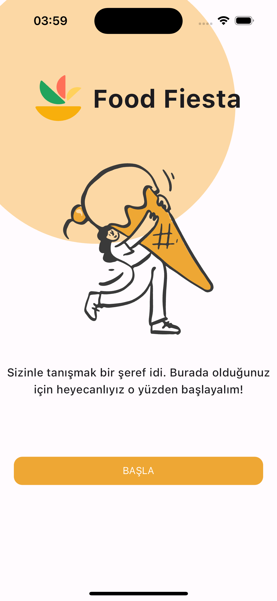
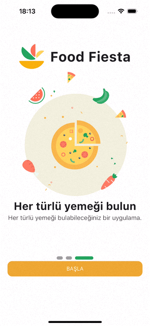

# Food Fiesta 
Flutter'da öğrendiğim tüm içeriklerin bu repoda olması için çalışacağım.

# Figma
[Figma'ya İlerle](https://www.figma.com/file/LQhk53Zfj03aOg6Z2Y1OMg/Food-App?type=design&node-id=0-1&mode=design&t=4mlpn1vqkTgpjQtf-0)

Bu hazır template'i seçmemin nedeni, içeriği gerçek bir proje geliştirilmesine yatkın bir şekilde oluşturulmuş.
Bu sebeple tercihim oldu. 

# TODO LİST

- UI effective şekilde performanslı oluşturulmalı.
- State Management için Bloc Pattern tercih edilecektir.
- Backend yapımı için Firebase - Node.JS - ASP.NET - GO tercihlerini inceleyip tercih edilmesi gerekmektedir.

<!-- Son Bitirdiğim Sayfa Görünümü:  -->

Son Bitirdiğim Sayfanın UI&UX Görünümü:

 
